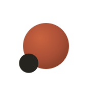

<p align="center">
  
</p>

# SubZeroClaw

> **WARNING: This software executes arbitrary shell commands with no safety checks, no confirmation prompts, no sandboxing, and no guardrails. The LLM decides what to run and the runtime runs it — `rm -rf /` included. There is nothing between the model's output and your system. If you don't understand what that means, do not use this. This is a bare agentic loop: execute the task, whatever it takes, nothing more, nothing less.**

**~550 lines of C. 55KB binary. A skill-driven agentic daemon for edge hardware.**

```
skill.md + LLM + shell + loop = autonomous agent
```

Every agentic runtime does the same thing: read a skill, call an LLM, execute tools, loop. SubZeroClaw is that principle written directly in C — no framework, no abstractions, no architecture mimicking a problem that never existed. One file, one loop, one tool.

## What it does

You write a skill as a markdown file. You point SubZeroClaw at it. It calls an LLM, executes tools, loops until done. That's the entire runtime.

```
~/.subzeroclaw/skills/monitor.md    ← what the agent knows
~/.subzeroclaw/config               ← API key + request_extra (model / routing policy)
~/.subzeroclaw/logs/<session>.txt   ← full I/O trace
```

The agent reads the skill into its system prompt, receives input, and autonomously calls tools until the task is complete. When context grows, the router signals it and the agent seals the old turns **asynchronously** (append-only, in the background) — it never pauses to compact (see "Routing & compaction via unhardcoded").

## Quickstart

```bash
git clone https://github.com/genlayerlabs/subzeroclaw
cd subzeroclaw
make                          # builds the 55KB binary in ~0.5s

mkdir -p ~/.subzeroclaw/skills
cat > ~/.subzeroclaw/config << 'EOF'
api_key = "sk-or-your-openrouter-key"
# The model is no longer a dedicated key — it rides in request_extra (the generic
# body-override channel). Direct provider: set the model. Against an unhardcoded
# router: send a policy instead — see "Routing & compaction via unhardcoded".
request_extra = "{\"model\": \"minimax/minimax-m2.5\"}"
EOF

./subzeroclaw "check disk usage and clean tmp if over 80%"
```

Clone, build, drop in an [OpenRouter](https://openrouter.ai) key, run. No daemon to register, no service to start. You need `gcc` to build and `curl` at runtime — everything else is in the box.

## Routing & compaction via unhardcoded

Two things a long agent loop needs — **routing with prompt-cache affinity** and
**context compaction** — were never part of "skill + LLM + shell + loop". They
belong to the substrate, not the agent. So rather than grow that logic in C,
SubZeroClaw points its `endpoint` at [**unhardcoded**](https://github.com/genlayerlabs/unhardcoded)
(MIT, open source) and expresses the behaviour as JSON instead of code:

- **The loop** — `request_extra` carries a routing policy and the model. The
  router picks the (provider, model) per call and keeps the conversation pinned
  to the peer that already holds its prompt-cache prefix (SubZeroClaw sends a
  per-run `session` id for that affinity), e.g.
  `{"model":"policy:auto","policy_ir":[ "policy", … cache_hot affinity … ]}`.
- **Compaction** — when the router signals context pressure (an `x_router.compact`
  flag on the response), SubZeroClaw fires an append-only seal at the router's
  `/v1/compact` **in the background** and keeps taking turns; when the sealed block
  lands it splices it in *ahead* of the turns that arrived meanwhile. Compaction is
  asynchronous — no turn is ever blocked, the prompt-cache prefix is never
  rewritten, and you never see a pause. The seal routing + how many recent turns to
  keep verbatim ride in `SUBZEROCLAW_COMPACT_EXTRA` (the second JSON), e.g.
  `{"keep_recent":8,"policy_ir":[ "policy", … cheap summariser … ]}`.

This is SubZeroClaw being *more* itself: the loop, the shell, the skill — on a
substrate that carries everything that was never "skill + LLM + shell + loop".
unhardcoded (MIT) is part of that substrate, on the same footing as the Linux
shell it `popen`s: just as there is no agent without a terminal, there is no
routing, cache, or compaction without the router. The runtime is designed to run
on unhardcoded — point `endpoint` at a bare provider and the HTTP call still
fires, but it is a degraded loop (no routing, no cache, no compaction — context
grows until the provider refuses it), not a supported standalone mode.

## Why not just use ZeroClaw / OpenClaw?

[ZeroClaw](https://github.com/zeroclaw-labs/zeroclaw) rewrites [OpenClaw](https://github.com/openclaw) in Rust. It's good software — but it inherits the architecture of the thing it's replacing: trait systems, channel adapters, observer patterns, identity formats, security layers. All solutions to problems that exist when you're building a multi-user, multi-channel platform.

If your problem is "run one skill on one Pi", none of that applies. You don't need channel adapters because there's one channel. You don't need a security model because you wrote the skill. You don't need a trait system because there's one provider.

SubZeroClaw doesn't simplify their architecture. It ignores it and writes the loop directly.

|                   | SubZeroClaw  | ZeroClaw     | OpenClaw     |
|-------------------|--------------|--------------|--------------|
| Language          | C            | Rust         | TypeScript   |
| Source            | ~550 lines        | ~15,000      | ~430,000     |
| Binary            | 55 KB             | 3.4 MB       | 80+ MB       |
| RAM (runtime)     | ~2 MB             | < 5 MB       | 80-120 MB    |
| Compiles on Pi    | 0.5s              | OOM          | slow         |
| Dependencies      | curl, unhardcoded | ~100 crates  | ~800 npm     |

## Tool

One tool: **shell**. `popen()` any command, stderr merged into stdout.

Since the LLM has a shell, it has `git`, `curl`, `himalaya`, `signal-cli`, `ffmpeg`, `jq`, `khal`, `pass` — whatever you install. For file operations, the model uses `cat`, `tee`, `sed`, etc. No adapters, no integrations. The adapter is the shell.

## Skills

Drop a `.md` file in `~/.subzeroclaw/skills/`. It becomes part of the system prompt.

```bash
cat > ~/.subzeroclaw/skills/backup.md << 'EOF'
## Backup Agent
You monitor /home/pi/data every hour.
- Run `rsync -avz /home/pi/data pi@nas:/backup/`
- If rsync fails, retry 3 times with 30s delay
- Log results to /home/pi/backup.log
EOF
```

No format spec. No skill registry. No trigger matching. Just plain text the LLM reads.

The skills included in this repo (`skills/`) are just examples to show the format. They reference tools and paths specific to one setup. Don't use them as-is — write your own for your system, your tools, your workflow. The whole point is that a skill is just a markdown file you write in 30 seconds.

## Build

```bash
make            # builds subzeroclaw (55KB)
make test       # runs the test suite
make install    # copies to ~/.local/bin/
```

Requires `libcjson-dev` or uses vendored cJSON automatically.

## Setup

```bash
mkdir -p ~/.subzeroclaw/skills

cat > ~/.subzeroclaw/config << EOF
api_key = "sk-or-your-openrouter-key"
# The model is no longer a dedicated key — it rides in request_extra (the generic
# body-override channel). Direct provider: set the model. Against an unhardcoded
# router: send a policy instead — see "Routing & compaction via unhardcoded".
request_extra = "{\"model\": \"minimax/minimax-m2.5\"}"
EOF
```

Or just use the `.env.example`:

```bash
cp .env.example .env
# Edit .env with your real API key
source .env
```

Environment variables override the config file:

```
SUBZEROCLAW_API_KEY
SUBZEROCLAW_ENDPOINT
SUBZEROCLAW_REQUEST_EXTRA   # the LOOP JSON, merged into every request body. Carries the
                           #   model ({"model":"..."}); against an unhardcoded router it carries
                           #   the routing policy too ({"model":"policy:auto","policy_ir":[...]}).
                           #   On a key collision the override wins.
SUBZEROCLAW_COMPACT_EXTRA  # the COMPACTION JSON. When set, an x_router.compact signal triggers
                           #   an async append-only seal at the router's /v1/compact; this carries
                           #   keep_recent + the cheap summariser policy_ir. Unset -> no compaction.
```

## Usage

```bash
# One-shot task
./subzeroclaw "check disk usage and clean tmp if over 80%"

# Interactive
./subzeroclaw
```

## Running as a service

SubZeroClaw is just the loop — it does not supervise itself. Restart-on-crash,
backoff, and logging belong to your init system, which already does them better
than a bundled supervisor could. Bring your own. A minimal systemd unit:

```ini
[Service]
ExecStart=/usr/local/bin/subzeroclaw "run the backup skill"
Restart=on-failure
RestartSec=5
User=subzero
EnvironmentFile=/etc/subzeroclaw.env   # root-owned, chmod 600: SUBZEROCLAW_API_KEY=...
```

This also gets you credential isolation for free, and it is the recommended way
to hold the key: run the agent as an unprivileged `User=`, and deliver the key
through the environment from a root-owned `EnvironmentFile` the agent's user
cannot read. SubZeroClaw scrubs `SUBZEROCLAW_*` from its own environment right
after reading config (see `config_load`), so the shell it hands the model never
inherits the key — `echo $SUBZEROCLAW_API_KEY` and `cat /proc/self/environ` come
up empty. The supervisor owns the secret; the agent only ever holds a copy in
memory. (None of this constrains what the shell can *do* — that is still
unguarded by design; it only keeps the runtime's own credential out of it.)

## Session logging

Every session gets a random hex ID. All input, output, tool calls, and results are logged to `~/.subzeroclaw/logs/<session>.txt` with timestamps.

```
=== f850c58ddd4ae72a Sun Feb 16 16:30:01 2026
[2026-02-16 16:30:01] USER: check disk usage
[2026-02-16 16:30:03] TOOL: shell
[2026-02-16 16:30:03] RES: /dev/sda1  72% /
[2026-02-16 16:30:04] ASST: Disk usage is at 72%, below threshold.
```

## Config reference

| Key | Default | Description |
|-----|---------|-------------|
| `api_key` | (required) | OpenRouter (or unhardcoded) API key |
| `request_extra` | (none) | the loop JSON merged into every request body — carries the `model`, and against an unhardcoded router the routing `policy_ir` |
| `compact_extra` | (none) | the compaction JSON — `keep_recent` + the cheap summariser `policy_ir`; unset disables compaction |
| `endpoint` | `https://openrouter.ai/api/v1/chat/completions` | API endpoint (point it at an unhardcoded router for routing/cache/compaction) |
| `skills_dir` | `~/.subzeroclaw/skills` | Path to skill markdown files |
| `log_dir` | `~/.subzeroclaw/logs` | Session log directory |
| `max_turns` | 200 | Max tool-call loops per input |

## Troubleshooting

| Symptom | Fix |
|---------|-----|
| `curl: command not found` or no response from the model | The runtime shells out to `curl` for API calls. Install it: `sudo apt install curl`. |
| `401 Unauthorized` from the endpoint | Missing or invalid key. Check `api_key` in `~/.subzeroclaw/config` or the `SUBZEROCLAW_API_KEY` env var. |
| Model never calls tools / loops without progress | Use a model that supports tool calling (set it in `request_extra`) — not every model does. |
| `make` fails on a fresh Pi | Install a compiler: `sudo apt install build-essential`. The vendored cJSON is used automatically when `libcjson-dev` is absent. |

## Source

```
src/
├── subzeroclaw.c   ~550 lines  The entire runtime
├── test.c                      the test suite
├── cJSON.c                     Vendored JSON parser
└── cJSON.h
```

## Philosophy

SubZeroClaw is an anti-framework. It does one thing: connect an LLM to a shell and loop. That's it. No plugin system, no middleware, no lifecycle hooks, no dependency injection. Just the loop.

This follows the Unix philosophy — do one thing and do it well. `grep` searches text. `curl` fetches URLs. `subzeroclaw` runs an agentic loop. It doesn't need to know about git, email, HTTP, or filesystems because the tools that already do those things are one `popen()` away. The model calls `git` the same way you do. The entire system is the integration layer.

Every layer of "framework" between the model and the shell is complexity that adds nothing. If the model can run `git`, why build a git adapter? If it can run `curl`, why build an HTTP tool? If it can run `tee`, why build a file-writing abstraction? Frameworks grow because they solve problems that emerge from their own architecture — channel routing because they support multiple channels, plugin registries because they have plugins, security models because they run untrusted code. SubZeroClaw has none of these problems because it doesn't have any of these features. One agent, one skill, one device. The code that remains is the code that can't be removed.

OpenClaw solved the agentic loop with 430,000 lines of TypeScript. ZeroClaw re-solved it with 15,000 lines of Rust. Both are good — but both carry the weight of problems that only exist at platform scale: multi-tenancy, channel routing, identity portability, plugin registries.

SubZeroClaw asks: what if the problem is just "one agent, one skill, one device"? Then the answer is ~550 readable lines of C.

## License

MIT
